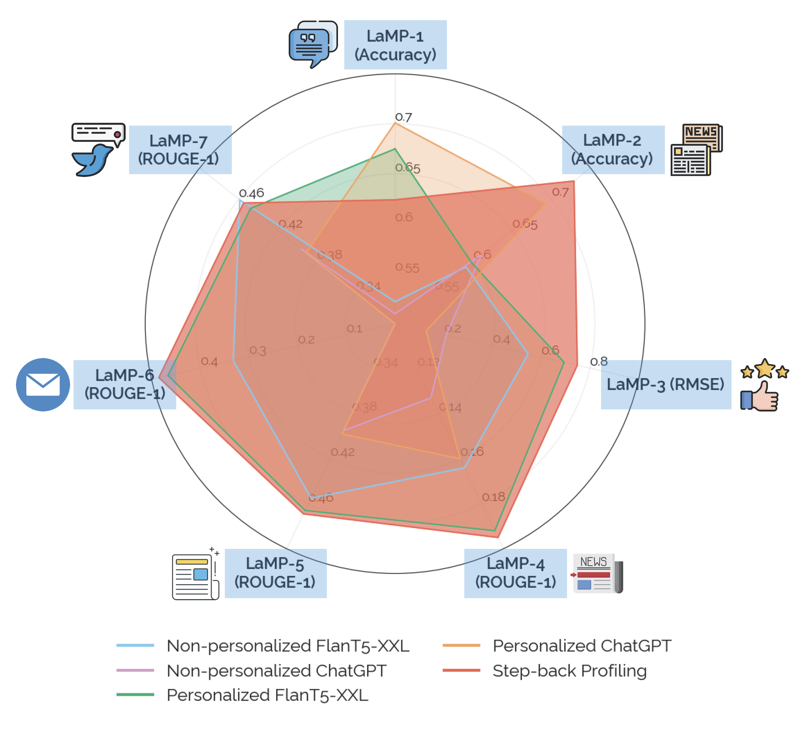

# STEP-BACK PROFILING: Distilling User History for Personalized Scientific Writing


This repository contains the code and dataset for the paper "STEP-BACK PROFILING: Distilling User History for Personalized Scientific Writing".


## Table of Contents
- [Dataset Generation](#dataset-generation)
- [Results Generation](#results-generation)
- [LaMP Result](#lamp-result)
- [Citation](#citation)
- [License](#license)

## Dataset Generation

The dataset generation process involves the following steps:

0. Download the raw data here [s2orc_4000.json](https://drive.google.com/file/d/1s9DCidREnhLLCLfTqYu0WTNd808XgCyz/view?usp=sharing)

1. Get sampled author list and paper list in JSON format:
   - `dataset/data_construction.ipynb`

2. Extract author's research interests:
   - `dataset/s2orc-rq.ipynb`

3. Extract research questions from papers:
   - `dataset/research_question_extraction.ipynb`

## PSW Results Generation

For generating results for each task, follow these steps:

1. Get User Profile:
   - `psw_result/author_profiling_cot.ipynb`

2. Generate title for single author:
   - `psw_result/single_agent_title_generation.ipynb`

3. Generate results for multiple authors & evaluation for each task:
   - `psw_result/task1_solving.ipynb`
   - `psw_result/task2_solving.ipynb`
   - `psw_result/task3_solving.ipynb`
   - `psw_result/task4_solving.ipynb`

## LaMP Results Generation



The `lamp_result/` directory contains the following notebooks:

- `lamp_result/cot_generation.ipynb`
- `lamp_result/final_output_generation.ipynb`
- `lamp_result/user_profile_generation.ipynb`

These notebooks are used for generating user profiles and final outputs for the LaMP dataset.

## Citation

If you find this work useful, please cite our paper:

```
@misc{tang2024stepback,
      title={Step-Back Profiling: Distilling User History for Personalized Scientific Writing}, 
      author={Xiangru Tang and Xingyao Zhang and Yanjun Shao and Jie Wu and Yilun Zhao and Arman Cohan and Ming Gong and Dongmei Zhang and Mark Gerstein},
      year={2024},
      eprint={2406.14275},
      archivePrefix={arXiv},
      primaryClass={cs.CL},
}
```

## License

This project is licensed under the MIT License. See the [LICENSE](LICENSE) file for more details.
